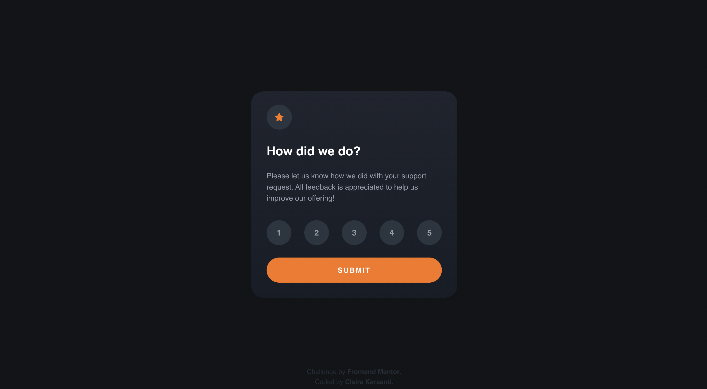
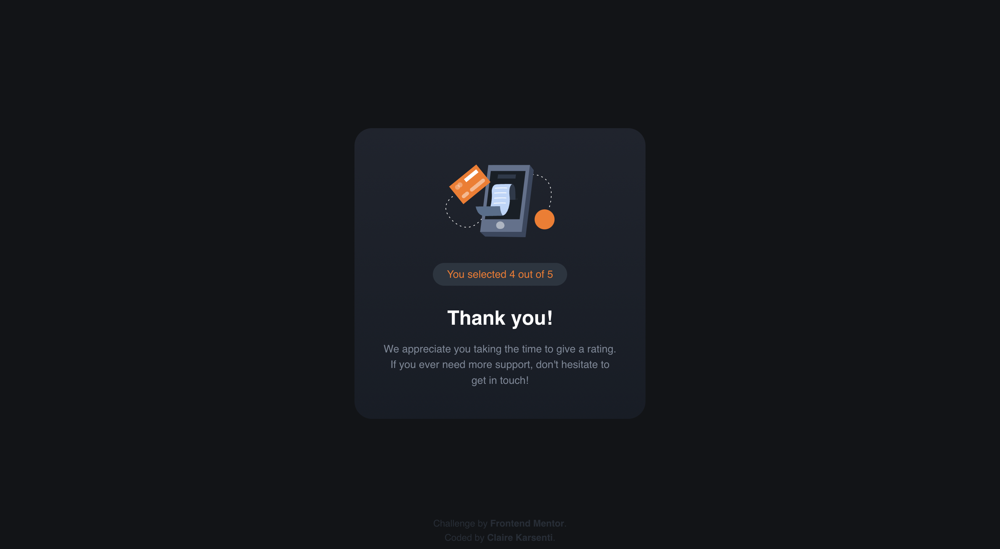
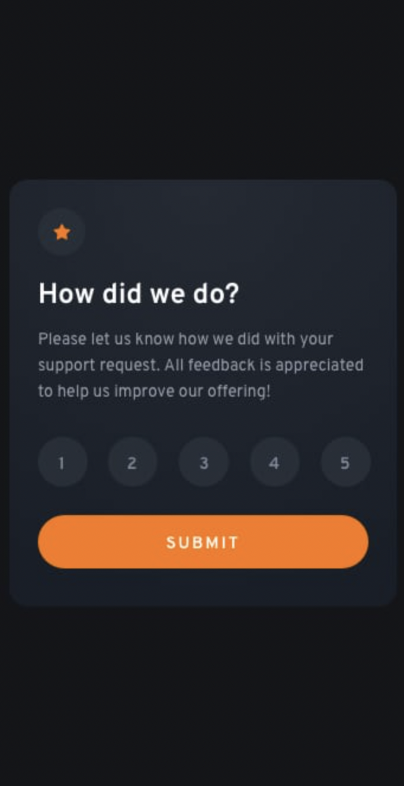
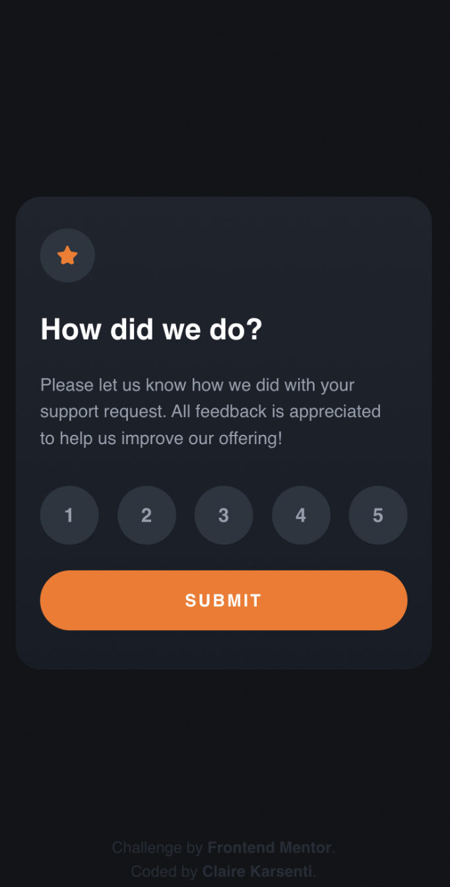
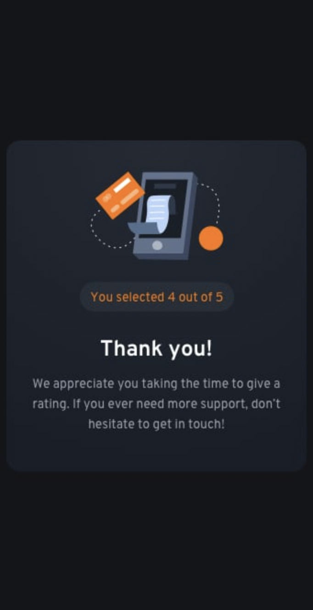
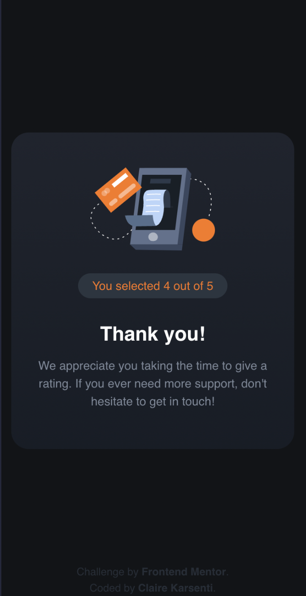
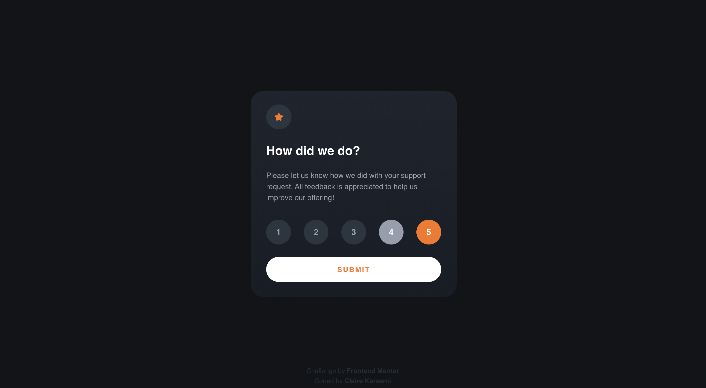
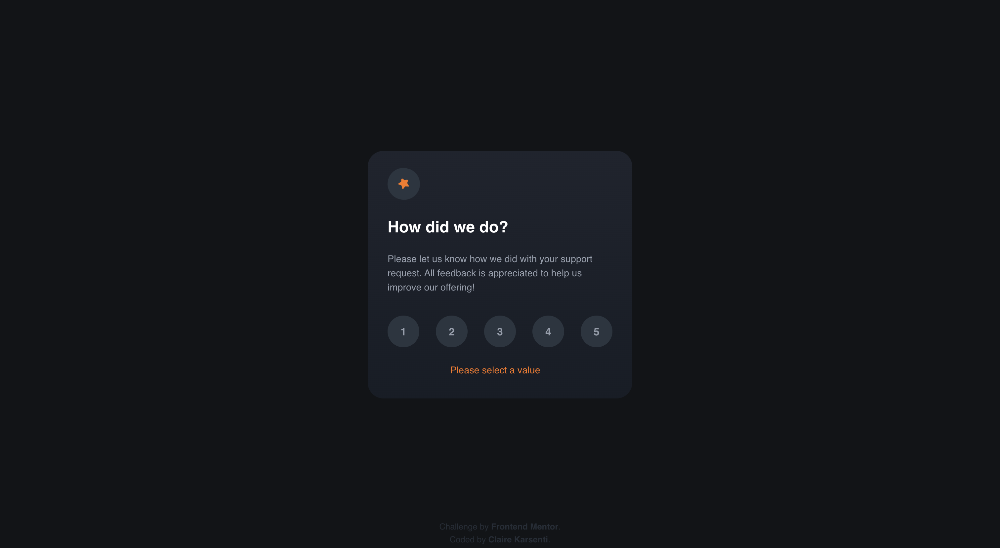

# Frontend Mentor - Interactive rating component solution

This is a solution to the [Interactive rating component challenge on Frontend Mentor](https://www.frontendmentor.io/challenges/interactive-rating-component-koxpeBUmI).
Frontend Mentor challenges help me improve my coding skills by building realistic projects.

## Table of contents

- [Frontend Mentor - Interactive rating component solution](#frontend-mentor---interactive-rating-component-solution)
  - [Table of contents](#table-of-contents)
  - [Overview](#overview)
    - [The challenge](#the-challenge)
    - [Models \& my works](#models--my-works)
      - [Desktop version](#desktop-version)
      - [Desktop Thank You State version](#desktop-thank-you-state-version)
      - [Mobile version](#mobile-version)
      - [Mobile Thank You State version](#mobile-thank-you-state-version)
      - [Active states version](#active-states-version)
      - [Custom feature](#custom-feature)
    - [Links](#links)
  - [My process](#my-process)
    - [Built with](#built-with)
    - [What I learned](#what-i-learned)
  - [Setup](#setup)
  - [Author](#author)

## Overview

### The challenge

Users should be able to:

- Select and submit a number rating
- See the "Thank you" card state after submitting a rating
- See hover and focus states for all interactive elements on the page

### Models & my works

#### Desktop version

| Model   |            |
| ------- | -------------------------------------------------------------------- |
| My work |  |

#### Desktop Thank You State version

| Model   |             |
| ------- | ------------------------------------------------------------------------------------ |
| My work |  |

#### Mobile version

| Model                                                    | My work                                                            |
| -------------------------------------------------------- | ------------------------------------------------------------------ |
|  |  |

#### Mobile Thank You State version

| Model                                                                   | My work                                                                            |
| ----------------------------------------------------------------------- | ---------------------------------------------------------------------------------- |
|  |  |

#### Active states version

| Model                      |                   |
| -------------------------- | -------------------------------------------------------------------------------- |
| My work with customization |  |

#### Custom feature



### Links

- Solution URL: [Code on GitHub](https://github.com/ClaireKarsenti/Interactive-Rating-Component)
- Live Site URL: [GitHub Pages Live URL](https://clairekarsenti.github.io/Interactive-Rating-Component/)

## My process

### Built with

- Semantic HTML5 markup
- CSS custom properties
- CSS Animations
- Grid
- Styled Components
- React
- TypeScript
- Mobile-first workflow

### What I learned

I choose to do this project in TypeScript language and with the framework React and in to deepen my skills in these fields.
This challenge also allowed me to deepen my knowledge of Grid and Styled Component for the layout part of this project.

I also challenged myself with this project to add some CSS animations to have a smoother user interface. I choose to add some animations for the entrance of the RatingCard and the ThankYouCard, as well as some animations for the submit button and the figure elements of the RatingCard, and finally for the shown of the alert message.

Here are some example of the other custom features I added to this project:

- :star: An animation on the star icon with `@keyframes`:

  ```css highlight="2,3"
  img {
    padding: 1rem;
    background-color: var(--mediumBlue);
    border-radius: 2em;
    margin-bottom: 1.5rem;
    animation: rotation 4s infinite linear;
    @keyframes rotation {
      from {
        transform: rotate(0deg);
      }
      to {
        transform: rotate(359deg);
      }
    }
  }
  ```

- :warning: A custom alert message for the scoreboard component. When the user clicks the submit button without having selected a number, the button disappears and instead displays a "Please select a value" alert message.

  ```js
  {
    (alert.show && <Alert {...alert} removeAlert={showAlert} />) || (
      <button type="submit">Submit</button>
    );
  }
  ```

- :chart_with_upwards_trend: One more hover feature on figure inputs with `transform: scale(1.10)`:

  ```css
  &:hover {
    background-color: var(--lightGrey);
    color: var(--white);
    transform: scale(1.1);
  }
  ```

## Setup

To run this project, install it locally using yarn:

```
yarn install && yarn start
```

## Author

- Linkedin - [Claire Karsenti](https://www.linkedin.com/in/claire-karsenti/)
- Frontend Mentor - [@ClaireKarsenti](https://www.frontendmentor.io/profile/ClaireKarsenti)
